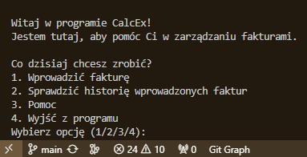
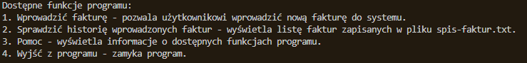
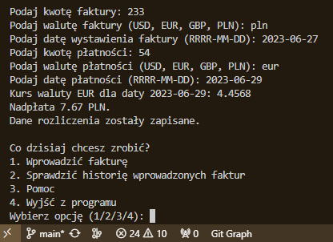
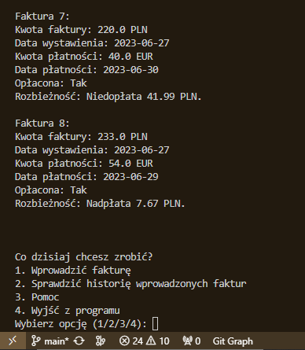

# Raport z projektu "CalcEx"

## Wprowadzenie
Projekt "CalcEx" jest prostą aplikacją do zarządzania fakturami. Głównym celem projektu jest umożliwienie użytkownikowi wprowadzania danych dotyczących faktur oraz ich płatności, obliczanie różnicy kursowej, zapisywanie faktur do pliku oraz wyświetlanie historii wprowadzonych faktur.

## Funkcje
1. welcome_message()
Funkcja odpowiedzialna za wyświetlenie powitalnej wiadomości użytkownikowi po uruchomieniu programu. Informuje użytkownika o nazwie programu oraz jego celu. 

```python
 def welcome_message():
    """Funkcja wyświetlająca powitalne wiadomości."""
    print("\n" * 50)  # Drukuje 50 pustych linii, "przewijając" ekran w górę
    print("Witaj w programie CalcEx!")
    print("Jestem tutaj, aby pomóc Ci w zarządzaniu fakturami.")
```

2. get_invoice_data()
Funkcja pobierająca od użytkownika dane dotyczące faktury, takie jak kwota, waluta i data wystawienia faktury. Obsługuje błędne dane wprowadzone przez użytkownika i prosi o ich ponowne wprowadzenie.

```python
def get_invoice_data():
    """Funkcja pobierająca dane dotyczące faktur od użytkownika."""
    while True:
        try:
            invoice_amount = float(input("Podaj kwotę faktury: "))
            break  # Wyjście z pętli jeśli wprowadzono poprawną kwotę
        except ValueError:
            print("Podana kwota jest nieprawidłowa. Spróbuj ponownie.")
    
    invoice_currency = input("Podaj walutę faktury (USD, EUR, GBP, PLN): ").upper()
    invoice_date = input("Podaj datę wystawienia faktury (RRRR-MM-DD): ")
    
    return invoice_amount, invoice_currency, invoice_date
```

3. get_payment_data()
Funkcja pobierająca od użytkownika informacje o płatnościach, takie jak kwota, waluta i data płatności. Podobnie jak funkcja get_invoice_data(), obsługuje błędne dane wprowadzone przez użytkownika.

```python
def get_payment_data():
    """Funkcja pobierająca informacje o płatnościach od użytkownika."""
    while True:
        try:
            payment_amount = float(input("Podaj kwotę płatności: "))
            break  # Wyjście z pętli jeśli wprowadzono poprawną kwotę
        except ValueError:
            print("Podana kwota jest nieprawidłowa. Spróbuj ponownie.")
    
    payment_currency = input("Podaj walutę płatności (USD, EUR, GBP, PLN): ").upper()
    payment_date = input("Podaj datę płatności (RRRR-MM-DD): ")
    
    return payment_amount, payment_currency, payment_date
```

4. get_exchange_rate(currency_code, date)
Funkcja pobierająca kurs wymiany walut z zewnętrznego API (NBP) na podstawie kodu waluty i daty. Obsługuje również wyjątki, takie jak brak dostępu do API lub niepoprawne dane.

```python
def get_exchange_rate(currency_code, date):
    if currency_code == 'PLN':
        # W przypadku PLN zwracamy kurs 1, bo nie musimy go pobierać z API
        return 1.0
    try:
        response = requests.get(f"https://api.nbp.pl/api/exchangerates/rates/a/{currency_code}/{date}/?format=json")
        data = response.json()
        rate = data['rates'][0]['mid']
        print(f"Kurs waluty {currency_code} dla daty {date}: {rate}")
        return rate
    except Exception as e:
        print(f"Błąd podczas pobierania kursu waluty: {e}")
        return None
```

5. calculate_exchange_difference(invoice_amount, invoice_currency, invoice_date, payment_amount, payment_currency, payment_date)
Funkcja obliczająca różnicę kursową pomiędzy kwotą faktury a kwotą płatności w przypadku różnych walut. Wykorzystuje funkcję get_exchange_rate() do uzyskania kursów wymiany walut.

```python
def calculate_exchange_difference(invoice_amount, invoice_currency, invoice_date, payment_amount, payment_currency, payment_date):
    invoice_rate = get_exchange_rate(invoice_currency, invoice_date)
    payment_rate = get_exchange_rate(payment_currency, payment_date)
    
    if invoice_rate is not None and payment_rate is not None:
        invoice_amount_pln = invoice_amount if invoice_currency == 'PLN' else invoice_amount * invoice_rate
        payment_amount_pln = payment_amount if payment_currency == 'PLN' else payment_amount * payment_rate
        exchange_difference = payment_amount_pln - invoice_amount_pln
        return exchange_difference
    else:
        return None
```
6. enter_invoice()
Funkcja umożliwiająca użytkownikowi wprowadzanie nowej faktury do systemu. Korzysta z funkcji get_invoice_data() i get_payment_data() do pobrania danych od użytkownika oraz z funkcji calculate_exchange_difference() do obliczenia różnicy kursowej.

```python
def enter_invoice():
    """Funkcja do wprowadzania faktury."""
    invoice_data = get_invoice_data()
    payment_data = get_payment_data()
    
    exchange_difference = calculate_exchange_difference(*invoice_data, *payment_data)
    if exchange_difference is not None:
        if exchange_difference < 0:
            print(f"Niedopłata {abs(exchange_difference):.2f} PLN.")
            discrepancy = f"Niedopłata {abs(exchange_difference):.2f} PLN."
        elif exchange_difference > 0:
            print(f"Nadpłata {exchange_difference:.2f} PLN.")
            discrepancy = f"Nadpłata {exchange_difference:.2f} PLN."
        else:
            print("Faktura opłacona w całości.")
            discrepancy = "Brak rozbieżności"
        
        # Zapisujemy fakturę do pliku wraz z informacją o rozbieżności
        save_invoice_to_file(invoice_data, payment_data, is_paid=True, discrepancy=discrepancy)
        
    else:
        print("Nie udało się obliczyć różnicy kursowej.")
```
7. show_invoice_history()
Funkcja wyświetlająca historię wprowadzonych faktur zapisanych w pliku "spis-faktur.txt". Obsługuje wyjątki, takie jak brak pliku lub błędy podczas odczytu.

```python
def show_invoice_history():
    """Funkcja do wyświetlania historii wprowadzonych faktur."""
    try:
        with open("spis-faktur.txt", "r") as file:
            print("Historia wprowadzonych faktur:")
            print(file.read())
    except FileNotFoundError:
        print("Nie znaleziono pliku spis-faktur.txt.")
    except Exception as e:
        print(f"Wystąpił błąd podczas odczytu pliku: {e}")
```
8. help_menu()
Funkcja wyświetlająca krótkie objaśnienie dostępnych funkcji programu w menu głównym. Pomaga użytkownikowi zrozumieć, jak korzystać z poszczególnych funkcji.

```python
def help_menu():
    """Funkcja wyświetlająca informacje o funkcjach programu."""
    print("\nDostępne funkcje programu:")
    print("1. Wprowadzić fakturę - pozwala użytkownikowi wprowadzić nową fakturę do systemu.")
    print("2. Sprawdzić historię wprowadzonych faktur - wyświetla listę faktur zapisanych w pliku spis-faktur.txt.")
    print("3. Pomoc - wyświetla informacje o dostępnych funkcjach programu.")
    print("4. Wyjść z programu - zamyka program.")
```
9. save_invoice_to_file
Funkcja zapisuje informacje o wprowadzonej fakturze do pliku tekstowego "spis-faktur.txt". Funkcja  dodatkowo tworzy lub otwiera plik "spis-faktur.txt" i zapisuje informacje o fakturze w formie czytelnej dla użytkownika. Znajduje się w pliku utilities.py.

```python
def save_invoice_to_file(invoice_data, payment_data, is_paid, discrepancy):
    try:
        filename = "spis-faktur.txt"
        with open(filename, "a") as file:
            with open(filename, "r") as f:
                num_invoices = sum(1 for line in f if line.startswith("Faktura"))
            file.write(f"Faktura {num_invoices + 1}:\n")
            file.write(f"Kwota faktury: {invoice_data[0]} {invoice_data[1]}\n")
            file.write(f"Data wystawienia: {invoice_data[2]}\n")
            file.write(f"Kwota płatności: {payment_data[0]} {payment_data[1]}\n")
            file.write(f"Data płatności: {payment_data[2]}\n")
            file.write(f"Opłacona: {'Tak' if is_paid else 'Nie'}\n")
            file.write(f"Rozbieżność: {discrepancy}\n")
            file.write("\n")
        print("Dane rozliczenia zostały zapisane.")
    except Exception as e:
        print(f"Błąd podczas zapisywania danych rozliczenia do pliku: {e}")
```
## Spostrzeżenia
Testowanie i debugowanie: Podczas rozwoju projektu napotkałem wiele błędów i nieprzewidzianych zachowań. Testowanie każdej nowej funkcji oraz debugowanie kodu było istotne w procesie rozwoju, aby upewnić się, że wszystko działa zgodnie z oczekiwaniami.

Iteracyjny proces: Projekt rozwijał się iteracyjnie, co oznaczało dodawanie, modyfikowanie i usuwanie funkcji w miarę potrzeb. Iteracyjny proces pozwolił na stopniowe ulepszanie kodu i dostosowywanie go do zmieniających się wymagań.

Zarządzanie błędami: W trakcie tworzenia projektu zrozumiałem, jak istotne jest skuteczne zarządzanie błędami. Dodanie obsługi wyjątków, walidacja danych wejściowych i odpowiednie komunikaty dla użytkownika pomogły w poprawnym działaniu programu i zapobieganiu "nieoczekiwanym" awariom.

Organizacja kodu: Ważne jest utrzymanie czytelnego i dobrze zorganizowanego kodu. Dzięki odpowiedniemu nazewnictwu zmiennych i funkcji, komentarzom oraz logicznemu podziałowi kodu na moduły, było łatwiej zrozumieć i zarządzać projektem.

Kontrola wersji: Korzystanie z systemu kontroli wersji, takiego jak Git, okazało się niezwykle przydatne. Pozwoliło to na monitorowanie zmian w kodzie oraz przywracanie poprzednich wersji. Nie było to moje pierwsze spotkanie z GITem natomiast po raz pierwszy skorzystałem z githuba.

### Zrzuty ekranu







### Kody źródłowe 

- [main.py]

```python
import requests
from utilities import save_invoice_to_file

def welcome_message():
    """Funkcja wyświetlająca powitalne wiadomości."""
    print("\n" * 50)  # Drukuje 50 pustych linii, "przewijając" ekran w górę
    print("Witaj w programie CalcEx!")
    print("Jestem tutaj, aby pomóc Ci w zarządzaniu fakturami.")

def get_invoice_data():
    """Funkcja pobierająca dane dotyczące faktur od użytkownika."""
    while True:
        try:
            invoice_amount = float(input("Podaj kwotę faktury: "))
            break  # Wyjście z pętli jeśli wprowadzono poprawną kwotę
        except ValueError:
            print("Podana kwota jest nieprawidłowa. Spróbuj ponownie.")
    
    invoice_currency = input("Podaj walutę faktury (USD, EUR, GBP, PLN): ").upper()
    invoice_date = input("Podaj datę wystawienia faktury (RRRR-MM-DD): ")
    
    return invoice_amount, invoice_currency, invoice_date

def get_payment_data():
    """Funkcja pobierająca informacje o płatnościach od użytkownika."""
    while True:
        try:
            payment_amount = float(input("Podaj kwotę płatności: "))
            break  # Wyjście z pętli jeśli wprowadzono poprawną kwotę
        except ValueError:
            print("Podana kwota jest nieprawidłowa. Spróbuj ponownie.")
    
    payment_currency = input("Podaj walutę płatności (USD, EUR, GBP, PLN): ").upper()
    payment_date = input("Podaj datę płatności (RRRR-MM-DD): ")
    
    return payment_amount, payment_currency, payment_date

def get_exchange_rate(currency_code, date):
    if currency_code == 'PLN':
        # W przypadku PLN zwracamy kurs 1, bo nie musimy go pobierać z API
        return 1.0
    try:
        response = requests.get(f"https://api.nbp.pl/api/exchangerates/rates/a/{currency_code}/{date}/?format=json")
        data = response.json()
        rate = data['rates'][0]['mid']
        print(f"Kurs waluty {currency_code} dla daty {date}: {rate}")
        return rate
    except Exception as e:
        print(f"Błąd podczas pobierania kursu waluty: {e}")
        return None

def calculate_exchange_difference(invoice_amount, invoice_currency, invoice_date, payment_amount, payment_currency, payment_date):
    invoice_rate = get_exchange_rate(invoice_currency, invoice_date)
    payment_rate = get_exchange_rate(payment_currency, payment_date)
    
    if invoice_rate is not None and payment_rate is not None:
        invoice_amount_pln = invoice_amount if invoice_currency == 'PLN' else invoice_amount * invoice_rate
        payment_amount_pln = payment_amount if payment_currency == 'PLN' else payment_amount * payment_rate
        exchange_difference = payment_amount_pln - invoice_amount_pln
        return exchange_difference
    else:
        return None

def enter_invoice():
    """Funkcja do wprowadzania faktury."""
    invoice_data = get_invoice_data()
    payment_data = get_payment_data()
    
    exchange_difference = calculate_exchange_difference(*invoice_data, *payment_data)
    if exchange_difference is not None:
        if exchange_difference < 0:
            print(f"Niedopłata {abs(exchange_difference):.2f} PLN.")
            discrepancy = f"Niedopłata {abs(exchange_difference):.2f} PLN."
        elif exchange_difference > 0:
            print(f"Nadpłata {exchange_difference:.2f} PLN.")
            discrepancy = f"Nadpłata {exchange_difference:.2f} PLN."
        else:
            print("Faktura opłacona w całości.")
            discrepancy = "Brak rozbieżności"
        
        # Zapisujemy fakturę do pliku wraz z informacją o rozbieżności
        save_invoice_to_file(invoice_data, payment_data, is_paid=True, discrepancy=discrepancy)
        
    else:
        print("Nie udało się obliczyć różnicy kursowej.")

def show_invoice_history():
    """Funkcja do wyświetlania historii wprowadzonych faktur."""
    try:
        with open("spis-faktur.txt", "r") as file:
            print("Historia wprowadzonych faktur:")
            print(file.read())
    except FileNotFoundError:
        print("Nie znaleziono pliku spis-faktur.txt.")
    except Exception as e:
        print(f"Wystąpił błąd podczas odczytu pliku: {e}")

def help_menu():
    """Funkcja wyświetlająca informacje o funkcjach programu."""
    print("\nDostępne funkcje programu:")
    print("1. Wprowadzić fakturę - pozwala użytkownikowi wprowadzić nową fakturę do systemu.")
    print("2. Sprawdzić historię wprowadzonych faktur - wyświetla listę faktur zapisanych w pliku spis-faktur.txt.")
    print("3. Pomoc - wyświetla informacje o dostępnych funkcjach programu.")
    print("4. Wyjść z programu - zamyka program.")

def main():
    welcome_message()
    while True:
        print("\nCo dzisiaj chcesz zrobić?")
        print("1. Wprowadzić fakturę")
        print("2. Sprawdzić historię wprowadzonych faktur")
        print("3. Pomoc")
        print("4. Wyjść z programu")
        
        choice = input("Wybierz opcję (1/2/3/4): ")
        
        if choice == '1':
            print("\n" * 50)  # Czyszczenie ekranu przed wywołaniem funkcji wprowadzania faktury
            enter_invoice()
        elif choice == '2':
            print("\n" * 50)  # Czyszczenie ekranu przed wywołaniem funkcji sprawdzania historii faktur
            show_invoice_history()
        elif choice == '3':
            print("\n" * 50)  # Czyszczenie ekranu przed wyświetleniem pomocy
            help_menu()
        elif choice == '4':
            print("\n" * 50)  # Czyszczenie ekranu przed wyjściem z programu
            print("Dziękujemy za skorzystanie z programu CalcEx. Do zobaczenia!")
            break
        else:
            print("Nieprawidłowy wybór. Spróbuj ponownie.")

if __name__ == "__main__":
    main()
```

- [utilities.py]

```python
def save_invoice_to_file(invoice_data, payment_data, is_paid, discrepancy):
    try:
        filename = "spis-faktur.txt"
        with open(filename, "a") as file:
            with open(filename, "r") as f:
                num_invoices = sum(1 for line in f if line.startswith("Faktura"))
            file.write(f"Faktura {num_invoices + 1}:\n")
            file.write(f"Kwota faktury: {invoice_data[0]} {invoice_data[1]}\n")
            file.write(f"Data wystawienia: {invoice_data[2]}\n")
            file.write(f"Kwota płatności: {payment_data[0]} {payment_data[1]}\n")
            file.write(f"Data płatności: {payment_data[2]}\n")
            file.write(f"Opłacona: {'Tak' if is_paid else 'Nie'}\n")
            file.write(f"Rozbieżność: {discrepancy}\n")
            file.write("\n")
        print("Dane rozliczenia zostały zapisane.")
    except Exception as e:
        print(f"Błąd podczas zapisywania danych rozliczenia do pliku: {e}")
```
---

> Raport przygotowany przez: [Krystian|54152]
> Data: [07.02.2024]